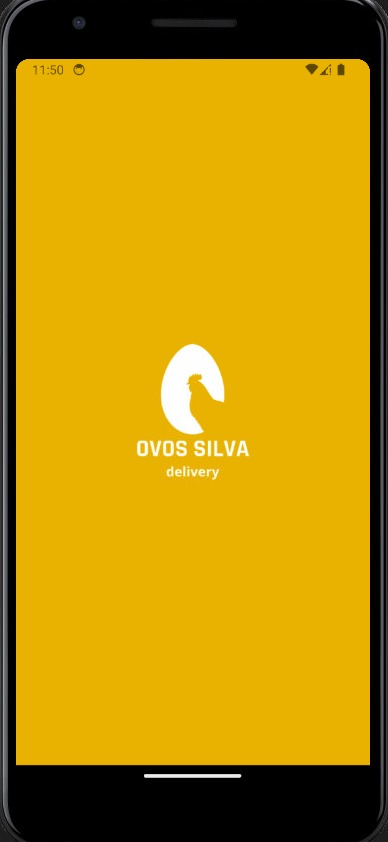
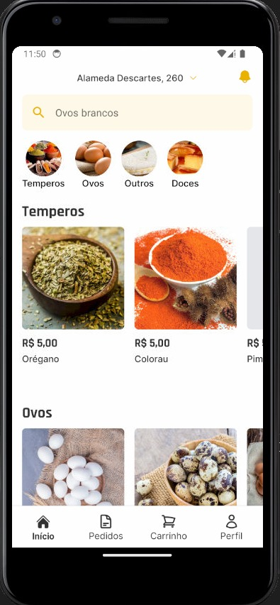

# OVOS SILVA: DELIVERY


> Soon description of the project

<div style="width:100%; display:flex; align-items:center; gap:16px">



</div>

## Detalhes do aplicativo

O aplicativo foi desenvolvido utilizando React Native + Expo, abordando tecnologias como: Redux, TypeScript e Tailwind CSS para estilização. 
Para o back-end, foi utilizado Node.js, Express.js, TypeScript e Firebase como banco de dados. O app está disponível apenas para android.
É um app para uma distribuidora chamada Ovos Silva onde é fornecido atravéz do app, a compra e entrega de produtos para a cidade de Bauru.


## 🚀 Melhorias implementadas
- [x] - Estilização com Tailwind CSS
- [x] - Manipulação de estado da aplicação com Redux
- [x] - Utilização de AsyncStorage para armazenamento interno de informações
- [x] - Foi utilizado a api do Expo para Push Notifications

## 💻 Como usar o projeto
Para gerar uma cópia do projeto e implementar as suas melhorias, esteja em um computador com Node Js instalado e siga as etapas abaixo:

1  Clone o projeto com o comando 
```
git clone https://github.com/devggui/ovos-silva-public
``` 
2  Acesse o projeto pelo terminal com o comando 
```
cd ovos-silva-public
```  
3  Instale as dependências necessárias com o comando
```
npm install
```
4  Rode o projeto com o comando
```
npx expo start -c
``` 
5  Ou acesse o aplicativo através do website [Ovos Silva na Play Store](https://play.google.com/store/apps/details?id=com.anonymous.silvaeggs) 

6. O catalogo de produtos não está disponível nesse repositório.


## 🌐 Links úteis
[React Native](https://reactnative.dev)  
[Expo](https://docs.expo.dev)
[NodeJS](https://nodejs.org/en/download)  
[Tailwind CSS](https://tailwindcss.com)
[Redux](https://redux.js.org)  


## 🧑‍💻 Guilherme Henrique

[](https://www.linkedin.com/in/devggui)
[](https://gthub.com/devggui)
[](http://wa.me/5514998619263)
[](https://devggui.netlify.app)